<h1 align="center">Hey there! I'm Rahul 👋</h1>

  
  
  <!-- Add your own links here, for example:
  
  -->

---

### ✨ Building AI products for healthcare

I'm a Computer Science student from Thrissur, Kerala. I build AI-powered products and contribute to open source, mostly around healthcare.

---

### 🌱 What I'm working on

- **[RxGuard](https://github.com/rahulmj2004/RxGuard):** a prescription review system for pharmacists. It flags medication-safety concerns and backs each one with evidence, while the pharmacist makes the final call.
- **[Intelligent IoT Anomaly Detection](https://github.com/rahulmj2004/intelligent-iot-anomaly-detection-v2):** detecting anomalies in IoT sensor data with Python.

---

### 🤝 Open source

I contribute to [CARE](https://github.com/ohcnetwork/care_fe) by the Open Healthcare Network, a Digital Public Good used for healthcare delivery.

- [#16943](https://github.com/ohcnetwork/care_fe/pull/16943): show schedule exception reasons in a tooltip
- [#16880](https://github.com/ohcnetwork/care_fe/pull/16880): enforce patient notes permissions

---

### 🛠 Tools I use

