

  
  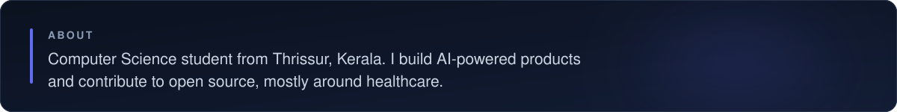

  
  <a href="https://github.com/rahulmj2004/RxGuard"></a>
  <a href="https://github.com/rahulmj2004/intelligent-iot-anomaly-detection-v2">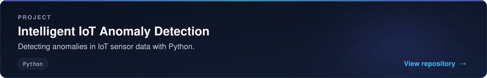</a>

  
  <a href="https://github.com/ohcnetwork/care_fe"></a>
  <a href="https://github.com/ohcnetwork/care_fe/pull/16943"></a>
  <a href="https://github.com/ohcnetwork/care_fe/pull/16880"></a>

  
  

